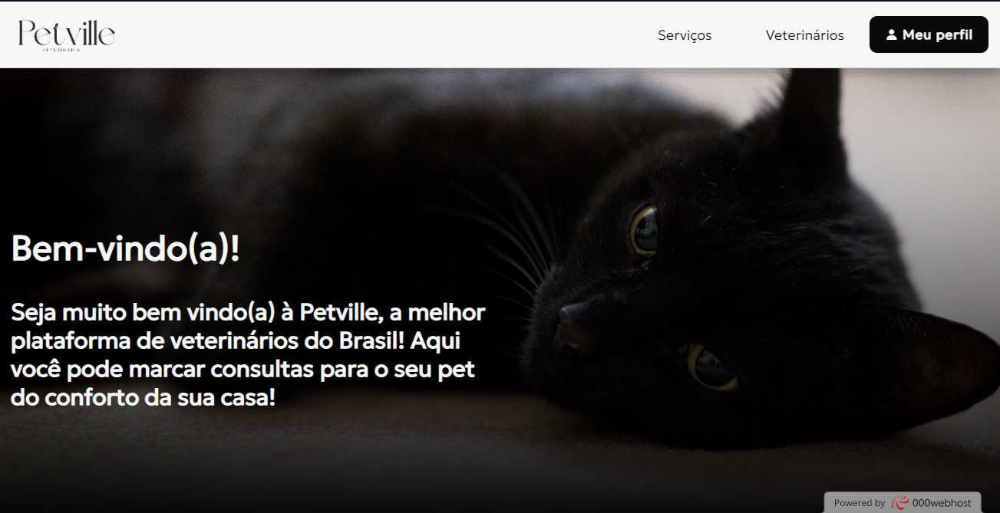
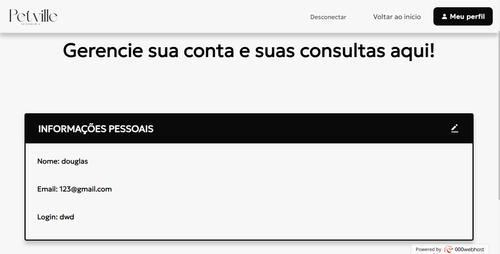
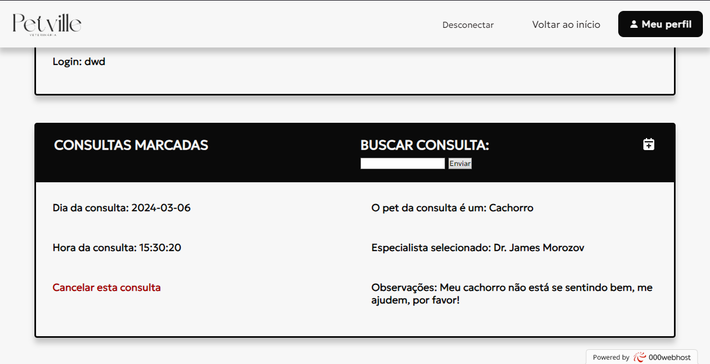

# Petville

Petville é um projeto de site onde os usuários podem criar um conta e marcar uma consulta com algum dos veterinários disponíveis.

Nas consultas, os usuários podem selecionar o dia em que os veterinários irão até sua casa, o animal que será atendido e os sintomas que levaram o cliente à procurar um veterinário.

**Link para acesso:** https://dieterpetville.000webhostapp.com/perfil.php

## Stack utilizada

**Front-end:** HTML5, CSS3

**Back-end:** PHP, JavaScript

**Database:** MySQL

## Screenshots

